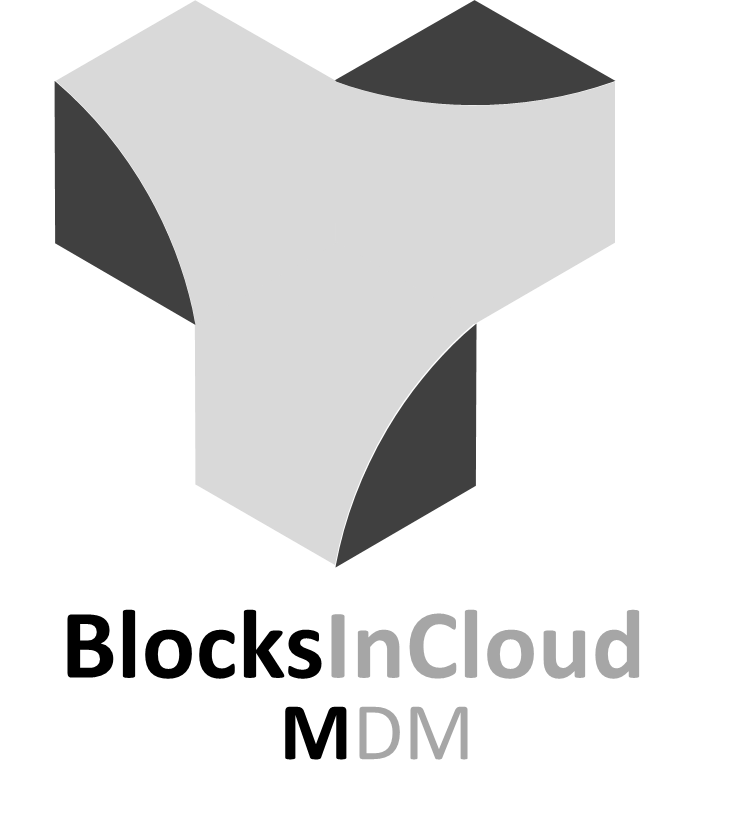
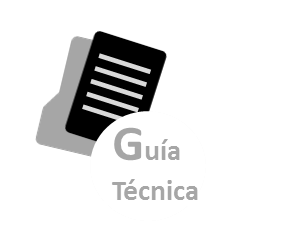
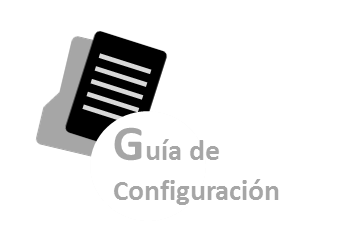
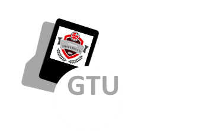

.. BlocksInCloud MDM documentation master file, created by
   sphinx-quickstart on Wed Sep 11 13:25:14 2019.
   You can adapt this file completely to your liking, but it should at least
   contain the root `toctree` directive.

===
MDM
===

.. centered:: |image0|

Revisión: 11-sep-2019 Equipo MDM

La línea de trabajo MDM corresponde a Master Data Management. Como dice su título, se trata de la creación de una nueva herramienta que permita realizar la gestión maestra de los datos que alimentan otras aplicaciones realizadas para Telepizza.

Por poner un ejemplo que sea ilustrativo, otra línea de trabajo a la que apoya MDM es Store que incluye una herramienta para la gestión de los pedidos en una tienda de Telepizza. Para realizar un pedido es importante que tengamos definidos los datos que vamos a pedir a un cliente por tipo de entrega por ejemplo y esto, es algo que vamos a poder configurar en MDM. Es decir, yo tendré una serie de filtros y funcionalidades dentro de la herramienta MDM para poder definir los datos que necesito pedir a un cliente para entregarle una pizza.

MDM da también respuesta a una necesidad de mayor usabilidad y menor formación por cara de los usuarios que realizan el mantenimiento de los datos. Actualmente estos deben manejar herramientas más bien de tipo técnico como programas de manejo de bases de datos tipo SQL que requieren cierta expertise, estos son los denominados mantenimientos manuales.

Además, hay una herramienta pre-existente al MDM llamada TPGescom que permite gestionar algunas de las entidades que Telepizza maneja actualmente. Sin embargo, TPGescom se trata de una herramienta desfasada ya que no solo su arquitectura y diseño son basados en tecnologías antiguas, sino que además no cubre totalmente las necesidades de gestión de datos actual de Telepizza.

**USUARIOS**

En este apartado se describirán todos los usuarios que van a acceder al sistema.

-  *Responsables de Producto:* Antonio Remesal

-  *Documentalistas:* Departamento de Control de Datos

-  *Responsables del proyecto:* David Expósito y Ana Martinez Used

**ALCANCE**

Este entorno debe recoger toda la información de los productos asociados a BlockInCloud, y aquellos que esta Suite necesita para su funcionamiento. Se incluirán en el mismo todas las versiones de la documentación que estén o puedan estar en uso.

**DOCUMENTACIÓN DE REFERENCIA**

|Guía Técnica|   |Guía Funcional|   |Guía Configuración|   |GTU| 

.. |Guía Funcional| image:: media/logo_funcional.png
   :width: 20%

